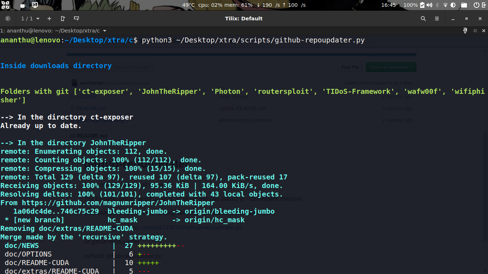

# Github repoupdater
The following python script updates all git repositories placed in ~/Downloads directory.


## Screenshots



## Installation 
```
* git clone https://github.com/ask1234560/github-repoupdater.git

* cd github-repoupdater

* python3 github-repoupdater.py 
```
